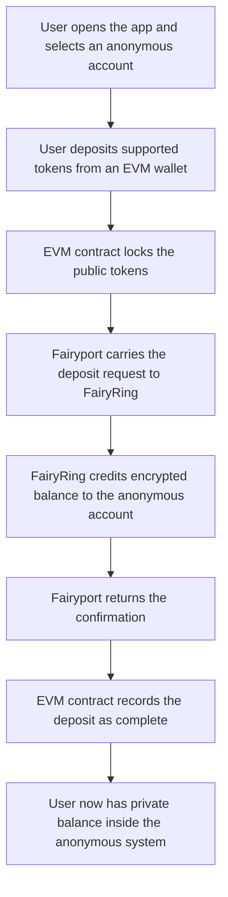
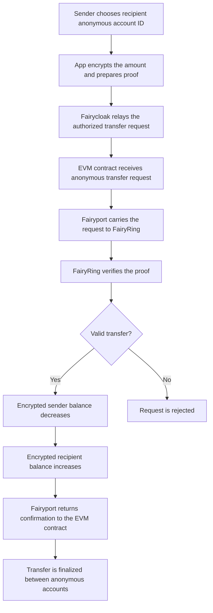
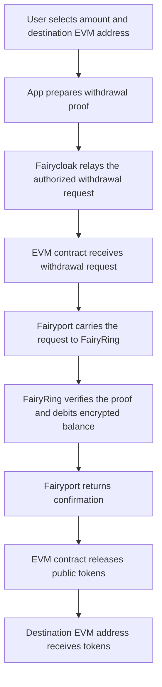

Anonymous Confidential Transfer extends the confidential transfer model by protecting not only the transaction amount, but also the public wallet identity involved in day-to-day transfers. In a standard confidential transfer, the amount is encrypted, but the sender and receiver are still represented by their public wallet addresses. Anonymous Confidential Transfer separates the confidential account from the public wallet, so users can transfer privately without exposing which EVM address is sending or receiving inside the confidential system.

The main idea is simple. A user holds funds in an anonymous confidential account instead of holding them directly under a visible wallet address. This account is identified by an account ID that is independent of the user's public EVM address. The user keeps the private keys needed to control and decrypt their own balance locally. The chain only stores encrypted balances and public information required to verify that each operation is valid.

### How the Flow Works
The lifecycle starts when a user creates or selects an anonymous account. This account has its own cryptographic identity inside the confidential system. The user can then move supported tokens into the anonymous transfer system. The underlying tokens are locked on the EVM side, while the corresponding confidential balance is created inside the anonymous account. A deposit is the entry point into the system and may still appear as a public funding action on the EVM chain. Once the funds are credited into the anonymous account, activity inside the anonymous system is based on the anonymous account, not on the user's public wallet address.

When the user wants to send funds, they enter the recipient's anonymous account ID and the transfer amount in the application. The amount is encrypted before it is submitted. The application also prepares a proof that shows the transfer is valid. This proof confirms important facts, such as the sender having enough balance and the transfer preserving the correct amount of value, without revealing the actual balance or transfer amount.

The transfer request is then submitted through Fairycloak. Fairycloak acts as the relay layer for anonymous confidential operations. Instead of the user broadcasting every anonymous transfer directly from their own wallet, Fairycloak submits the operation to the EVM contract on the user's behalf. This helps keep the user's public wallet address separate from the anonymous transfer activity. Fairycloak pays the gas required for these operations and is compensated through the protocol's fee flow. Importantly, Fairycloak does not need to know the private transfer amount, cannot change the encrypted balance update, and cannot make an invalid transfer pass verification.

Once the request reaches the EVM contract, it is passed into the Fairblock confidentiality flow. Fairyport carries the request between the EVM chain and FairyRing. Fairyport is responsible for moving the request and response messages across chains. It does not decide whether a transfer is valid, does not control user funds, and does not gain access to the hidden amount. Its role is transportation and coordination between the connected chain and FairyRing.

FairyRing performs the confidential execution. It verifies the proof attached to the transfer request and updates the encrypted balances if the transfer is valid. The sender's encrypted balance is reduced and the recipient's encrypted balance is increased, but the plaintext amounts are never published onchain. The recipient can later decrypt their own balance locally using their own keys.

After FairyRing processes the request, a response is returned to the EVM side through Fairyport. The EVM contract updates the state of the anonymous transfer request accordingly. From the user's perspective, the result is a private transfer between anonymous accounts. Public observers can see that protocol activity happened, but they do not see the transferred amount or a direct sender and receiver wallet pair for the anonymous transfer.

### Simplified Flow Diagrams
The diagrams below show the three main user flows at a high level. They are intentionally simplified and focus on what happens from the user's point of view, rather than on low-level relayer behavior or implementation details.

#### Anonymous Deposit
A deposit moves tokens from a public EVM wallet into an anonymous confidential account. The public tokens are locked on the EVM side, and the anonymous account receives a corresponding encrypted balance inside the confidential system.

#### Anonymous Transfer
An anonymous transfer moves value between two anonymous accounts. The amount is encrypted, the proof shows that the transfer is valid, and Fairycloak helps submit the request without linking routine transfer activity directly to the user's public wallet transactions.

#### Anonymous Withdrawal
A withdrawal exits the anonymous layer. The anonymous account balance is debited privately, then the EVM contract releases the corresponding public tokens to the selected destination address.

### Withdrawals from Anonymous Accounts
Users can also withdraw from an anonymous account back to a public EVM address. A withdrawal intentionally converts part of the private balance back into public tokens. The user prepares a withdrawal request and a proof showing that the anonymous account has enough balance. Fairycloak relays the request, FairyRing verifies the proof and debits the encrypted balance, and the EVM contract releases the corresponding tokens to the chosen destination address.

<Note>
  The withdrawal destination is public because the tokens are being released on a public EVM chain. This is an important distinction. Anonymous Confidential Transfer protects activity inside the confidential system, but a withdrawal creates a public onchain payment to the selected address. Users and applications should treat withdrawals as the point where value exits the anonymous layer and becomes visible again on the destination chain.
</Note>

### Role of Fairycloak
Fairycloak is the user-facing relay layer for anonymous confidential transfers. Its main purpose is to prevent routine anonymous operations from being directly tied to the user's public wallet transactions. It receives user-authorized requests, submits them to the EVM contract, and handles the gas payment for relayed operations.

Fairycloak improves privacy and usability at the same time. Users do not need to manage gas for every anonymous transfer, and public observers do not see the user's wallet submitting each private operation. Fairycloak is still not trusted with the user's funds or secrets. The actual validity of each operation is enforced by cryptographic proofs and by the contracts that process them.

### Role of Fairyport
Fairyport connects the EVM side of the system with FairyRing. For anonymous confidential transfers, it carries requests from the EVM contract to FairyRing and returns the result back to the EVM contract. This allows the EVM chain to remain the user's familiar settlement environment while FairyRing provides the confidential execution layer.

Fairyport is a relayer, not a decision maker. It cannot create valid transfers by itself, cannot decrypt private balances, and cannot alter the result of a transfer without detection. The protocol relies on verified messages and contract checks, while Fairyport provides the communication path needed to complete the flow.

### Privacy and Control
Anonymous Confidential Transfer is designed around three practical privacy goals. First, transfer amounts remain encrypted. Second, the sender and recipient inside the anonymous transfer system are represented by anonymous account IDs rather than public wallet addresses. Third, relayed execution through Fairycloak reduces the visible link between a user's wallet and their anonymous transfer activity.

Control remains with the user. The user keeps the keys needed to access and decrypt their own confidential balance. The protocol verifies transfers without exposing the private financial details behind them. If compliance controls are enabled for a deployment, specific anonymous accounts can be restricted according to the application's policy without exposing all user balances or weakening confidentiality for the entire system.
