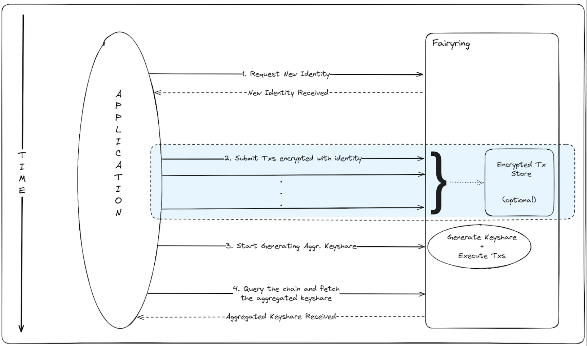

**Acting onchain leaks your intent before it executes.**

Serious markets never let you see the other side's hand before a trade clears. Bidders don't reveal their number before an auction closes. Traders don't broadcast an order before it fills. Voters don't publish a running tally mid-vote. On public blockchains, the opposite is true: every order, bid, vote, and intent sits in the open mempool before it executes, visible to anyone watching. That's exactly the kind of exposure that lets bots and insiders extract value from ordinary users.

When pre-execution data leaks, it creates problems:

<Warning>
  - Bots frontrun and sandwich your trades, extracting value (MEV) at your expense
  - Competitors copy your orders, bids, and strategy in real time
  - Auctions, launches, and votes get gamed by whoever can see incoming activity first
  - Validators and sequencers can reorder or censor transactions to their own advantage
</Warning>

This is the hidden tax every open market pays today: price discovery is distorted because participants are forced to reveal their hand before the trade settles. It's why high-value trading, auctions, and settlement still hesitate to run fully onchain.

**Our thesis**: markets are only fair when no one can see a transaction before it executes.

## Defining Pre-Execution Privacy

Transactions are encrypted under a public key and only decrypt once a specified condition is met; a block height, a price trigger, a proof, or an auction close. When the condition fires, a decentralized validator set derives the decryption key and the transaction is decrypted and executed at the start of the block, before anyone can react to it. This combination lets you:

- Protect orders, bids, and votes from frontrunning and manipulation
- Get deterministic, fair ordering without a trusted operator
- Selectively disclose only what's needed, only when it's required

It is not a private mempool run by one operator, and not a reordering service. It is programmable, decentralized conditional decryption built for open markets. No single sequencer, decryptor, or privileged party can peek at, leak, or censor an encrypted transaction, because the keys are produced by a threshold of validators (MPC-IBE).

## Core Applications

<AccordionGroup>
  <Accordion title="Sealed-Bid Auctions" icon="gavel">
    - Encrypted bids that stay hidden until the auction closes
    - One fair clearing outcome, with no privileged party able to peek or leak bids

    If bids are visible while an auction is live, they get copied and undercut. Keeping them encrypted until close gives every bidder the same information and a fair result.
  </Accordion>

  <Accordion title="DeFi & Trading" icon="chart-line">
    - Encrypted orderflow, limit orders, and intents resistant to frontrunning and sandwiching
    - Fair price discovery for trading and lending markets

    If the market can see size and timing before execution, that edge is handed straight to bots. Encrypting orders until they settle stops them from working against you.
  </Accordion>

  <Accordion title="Governance" icon="check-to-slot">
    - Private voting where ballots stay encrypted until the vote closes
    - Removes vote-buying and last-minute strategic voting

    When running tallies are public, late voters game the outcome. Confidential ballots keep governance honest until the result is revealed.
  </Accordion>

  <Accordion title="Onchain Games & Hidden Information" icon="gamepad">
    - Encrypted moves, cards, and state for games that need hidden information
    - State that only reveals under the rules of the game

    Fully transparent state makes hidden-information gameplay impossible. Conditional decryption brings it onchain.
  </Accordion>

  <Accordion title="Access Control & Selective Disclosure" icon="user-lock">
    - Encrypt data so only a specific party or group can decrypt it
    - Reveal a specific transaction, and only that one, when required

    Not everything should be fully public or fully private. Scoped, per-condition access lets authorized parties see exactly what they need, and nothing more.
  </Accordion>
</AccordionGroup>

## Why Fairblock

<CardGroup cols={2}>
  <Card title="No trusted decryptor" icon="shield-halved">
    Decryption keys are generated by a decentralized validator set using threshold cryptography (MPC-IBE). There is no single sequencer, operator, or key holder that can peek at, leak, or censor encrypted transactions.
  </Card>
  <Card title="Lightweight and fast" icon="bolt">
    The cryptography is light enough to run inside a normal transaction flow. There are no multi-minute proofs and no dependence on heavyweight offchain computation, so pre-execution privacy stays practical for real trading, auctions, and settlement.
  </Card>
  <Card title="No black-box trust" icon="circle-check">
    Correctness is verified onchain. Fairblock intentionally avoids single-TEE setups, outsourced provers, and centralized offchain coprocessors, minimizing trust assumptions and security risk.
  </Card>
  <Card title="Confidentiality where liquidity already lives" icon="location-dot">
    Pre-execution privacy is available across the ecosystems you already use, including EVMs and Cosmos chains, so you keep your existing wallets, liquidity, and workflows without bridging into an isolated privacy chain.
  </Card>
</CardGroup>

## Next Steps

<CardGroup cols={2}>
  <Card title="Architecture" icon="sitemap" href="/pep/get-started/architecture">
    Understand the MPC-IBE design powering pre-execution privacy.
  </Card>
  <Card title="Quick Start" icon="bolt" href="/pep/get-started/quick-start">
    Run your first confidential app on FairyRing or an EVM.
  </Card>
</CardGroup>

